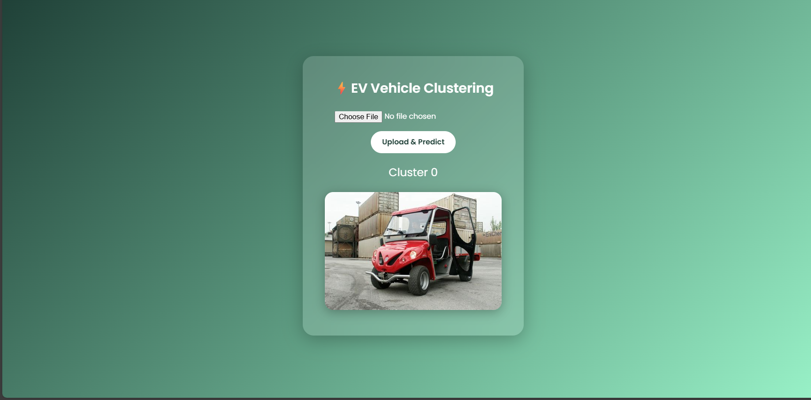
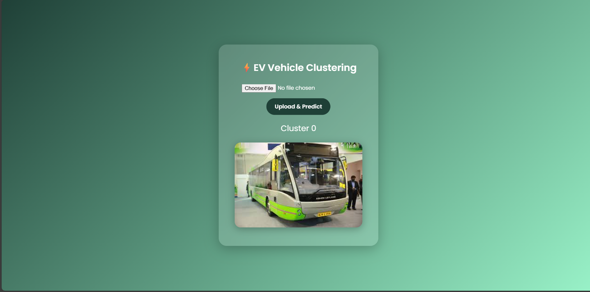

# ⚡🚗 EV Vehicle Clustering using K-Means

An Unsupervised Machine Learning project that groups Electric Vehicles into clusters using the **K-Means algorithm**.

Unlike classification, this project does not use predefined labels.  
Instead, it discovers patterns and groups EVs based on feature similarity.

---

## 📌 Project Overview
 
Using **K-Means Clustering**, this project groups EVs into:

- 🔵 **Cluster 0**
- 🟢 **Cluster 1**

These clusters represent natural groupings discovered by the algorithm.

---

## 🧠 Algorithm Used

### 🔹 K-Means Clustering

K-Means works by:

1. Selecting `K` cluster centroids
2. Assigning each data point to the nearest centroid
3. Recalculating centroids
4. Repeating until convergence

In this project:

K = 2

---

## ⚙️ Tech Stack

- Python
- tensorflow
- opencv-python
- numpy
- scikit-learn
- flask
- joblib

---

## 🔄 Workflow

1. Data Collection  
2. Data Cleaning  
3. Feature Scaling (StandardScaler)  
4. Choosing Optimal K (Elbow Method)  
5. Applying K-Means  
6. Cluster Visualization  
7. Interpretation of Clusters  

---
## 🖼 Cluster Output Screenshots

### 🔹 Cluster 0 Samples

---

### 🔹 Cluster 1 Samples

---